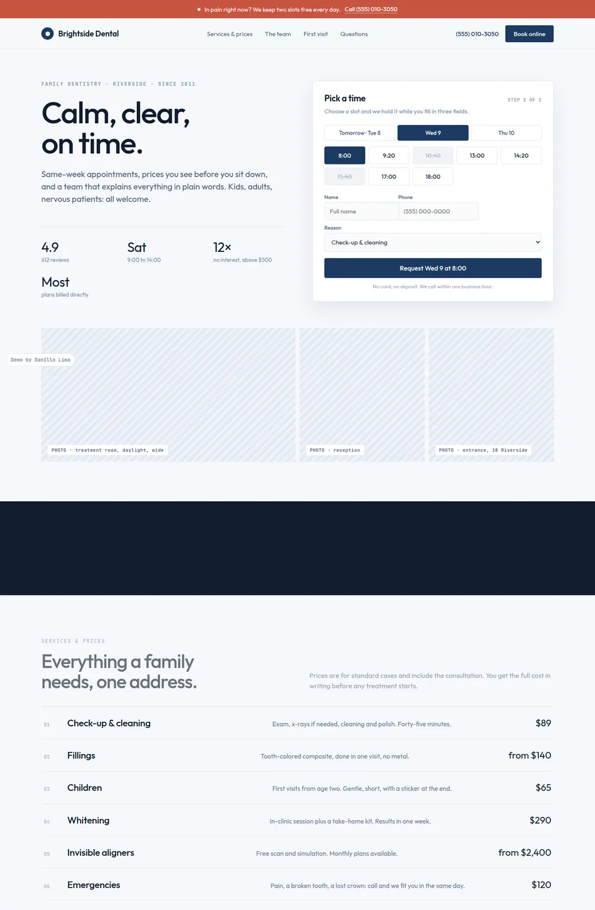
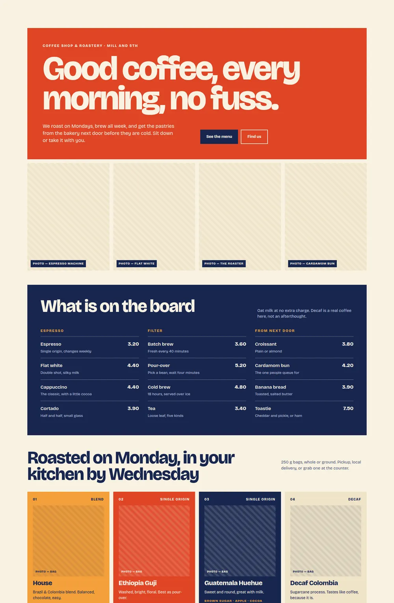

# Demo sites

Small-business websites I design and build, live at:

| Site | Business | Live |
|---|---|---|
| [Brightside Dental](brightside-dental/) | family dental clinic, with an online slot picker for appointments | https://dental.leadsignal.com.br |
| [Corner Roast](corner-roast/) | coffee shop and small roastery, "riso poster" direction | https://coffee.leadsignal.com.br |

Each site is a single HTML file: plain HTML and CSS, Google Fonts, and a few lines of JavaScript for the one interaction the page needs (the appointment picker, the newsletter confirmation). No framework, no build step, no page builder. Open the file in a browser and it works.

The businesses, people, addresses, phone numbers and prices are fictional. Photos are placeholders until stock photography is added.

More sites, the news portals and the admin panels are at https://leadsignal.com.br.

## Screenshots

## License

MIT. Use the code as you like; the fictional brands are not real businesses.
